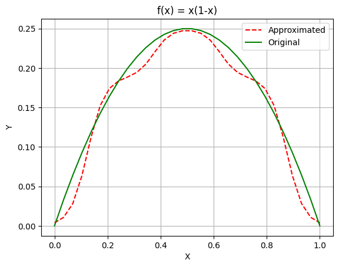

# Overview

We want to approximate the function $f(x) = x(1-x)$ where  $x \in [0,1]$

you can run the example with the following command.

```bash
cargo run --example function-approximation
```

## Problem Definition

We want to approximate the function in this specified domain with 5 points. I choose this 5 point to be equally spaced from each other. So the points are `X = [0.0,0.25,0.5,0.75,1.0]` by computing the original function in these points we can find `Y =[0.0,.1875,0.25,0.1875,0.0]`. We can see that this vector is symmetric so we can just use 3 of them instead of all 5.

### Import

We will import the necessary modules:

```rust
use fuzzy_logic_rs::{
    defuzzifications::TSKDefuzzifiers,
    fuzzy_inference_systems::TSKFIS,
    membership_functions::{Gaussian, MFKind, MembershipFunction},
    rules::Rule,
    s_norms::SNorms,
    t_norms::TNorms,
    variables::{InputVariable, TSKOutputVariable},
};
```

### Setup

First we add some variables and a closure to help us in the future.

```rust
let x1 = 0.0;
let x2 = 0.25;
let x3 = 0.5;
let x4 = 0.75;
let x5 = 1.0;
let original_function = |x| x * (1.0 - x);
let y15 = original_function(x1);
let y24 = original_function(x2);
let y3 = original_function(x3);
```

Then, we will using TSK FIS with the following configurations.

```rust
let mut fis = TSKFIS::new(SNorms::Max, TNorms::Min, TSKDefuzzifiers::Mean);
```

### Inputs

We have only on input that is `x`. We choose Gaussian membership function for all of
this variables's membership function, and then add this variables to the system.

```rust
let mut x: InputVariable = InputVariable::new("X".to_string(), (0.0, 1.0));
x.add_membership(MembershipFunction::new(
    "x1".to_string(),
    MFKind::Gaussian(Gaussian::new(x1, 0.09)),
));
x.add_membership(MembershipFunction::new(
    "x2".to_string(),
    MFKind::Gaussian(Gaussian::new(x2, 0.09)),
));
x.add_membership(MembershipFunction::new(
    "x3".to_string(),
    MFKind::Gaussian(Gaussian::new(x3, 0.09)),
));
x.add_membership(MembershipFunction::new(
    "x4".to_string(),
    MFKind::Gaussian(Gaussian::new(x4, 0.09)),
));
x.add_membership(MembershipFunction::new(
    "x5".to_string(),
    MFKind::Gaussian(Gaussian::new(x5, 0.09)),
));
fis.add_input(x);
```

### Outputs

This function is only have one output. I choose 3 memberships because this function is symmetric about line $x=1$ and the data is also symmetric. You can use 5 functions with no difference in output.

```rust
let mut y: TSKOutputVariable = TSKOutputVariable::new("Y".to_string());
y.add_constant_membership(y15);
y.add_constant_membership(y24);
y.add_constant_membership(y3);

fis.add_output(y);
```

### Rules

Rules for this problem is simple.

1. IF x IS x1 THEN Y15.
2. IF x IS x2 THEN Y24.
3. IF x IS x3 THEN Y3.
4. IF x IS x4 THEN Y24.
5. IF x IS x5 THEN Y15.

We can define the rules now:

```rust
fis.add_rule(Rule::new_and(vec![0, 0], 1.0));
fis.add_rule(Rule::new_and(vec![1, 1], 1.0));
fis.add_rule(Rule::new_and(vec![2, 2], 1.0));
fis.add_rule(Rule::new_and(vec![3, 1], 1.0));
fis.add_rule(Rule::new_and(vec![4, 0], 1.0));
```
!!! Note "Weights and Complements"
    You can change weights and changing the second argument, and you can add `-` sign to complement that variables

### Output

The problem formulation is done and we can use this to compute the output of the system:

```Rust
let out: Vec<f64> = fis.compute_outputs(vec![0.6]);
println!("{:?}", out);
```

If we run it the output will be:

```bash
❯ cargo run --example function-approximation
   Compiling fuzzy-logic_rs v0.5.0 
    Finished `dev` profile [unoptimized + debuginfo] target(s) in 0.31s
     Running `target/debug/examples/function-approximation`
[0.2301986089076184]
```

### Plot

We can plot this approximation and compare it to the original function.


You can add more points to improve its accuracy, but with only 5 points it gave us a good result.
